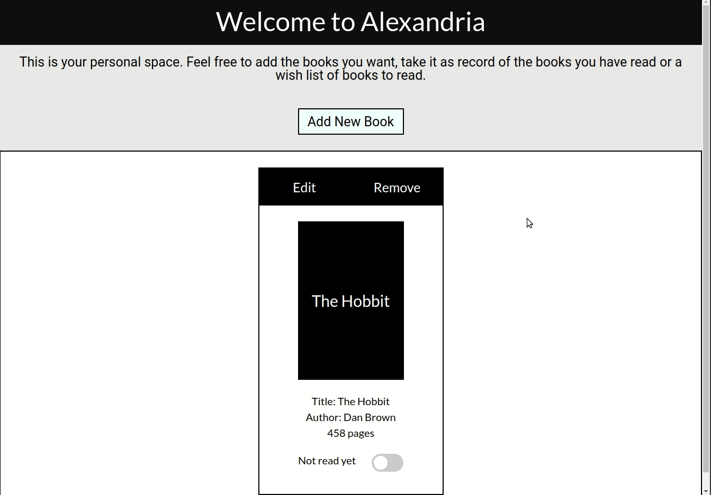

# Project Title

> The complete webpage to store your preferred books. This is an Odin Project exercise to practice objects and Object-constructors, using JavaScript..



Keep track of the books you've read on a private, local webpage. Store its title, author, number of pages. Check if you've already read it or add it as the next one in the list. Add an external url to have the cover of it. Enjoy your personal library!

## Built With

- HTML/CSS, JavaScript
- Visual Studio Code

## Live Demo

[Live Demo Link](https://johnftitor.github.io/library/)


## Getting Started

To get a local copy up and running follow these simple example steps.

- Clone this repository with git clone```https://github.com/JohnFTitor/library.git``` using your terminal or command line.
- Change to the project directory by entering : <br>
```cd library``` in the terminal

### Setup

You can clone this repository or simply download the files as a .zip
If you want to set up a personal repository based on this one, you can as well fork it.

### Usage

You're free to use this project however you like it for educational purposes. Just keep in mind the acknowledgment described below

### Deployment

The deployment can be found in the Github Pages of this repository or through the link provided above

## Authors

👤 **Andrés Felipe Arroyave Naranjo**

- GitHub: [@JohnFTitor](https://github.com/JohnFTitor)
- Twitter: [@johnftitor](https://twitter.com/johnftitor)
- LinkedIn: [Andres](https://www.linkedin.com/in/andresfelipe117/?locale=en_US)

## Show your support

Give a ⭐️ if you like this project!
